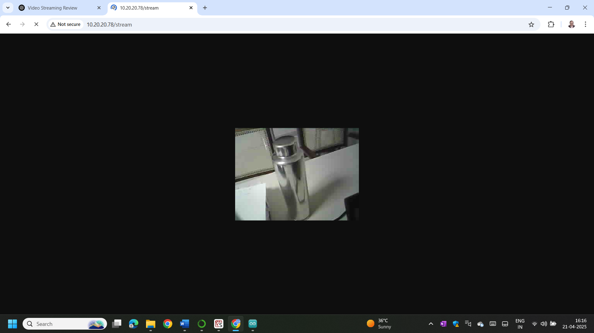

# ESP32Cam-OV2640Camera Wi-Fi Web Server for MJPEG Video Streaming & Multi-Resolution Still Capture  -  By Prof.(Dr).K.K. Thyagharajan, Dean(Research), RMD Engineering College


A lightweight Wi-Fi web server for the ESP32-CAM (AI-Thinker) board that provides a live MJPEG video stream and serves high-quality JPEG still images. Designed as a perfect, flexible video source for computer vision projects, remote monitoring, and Deep Learning object detection pipelines.

## 🚀 Installation & Setup

1. **Clone this repository:**
   ```bash
   git clone https://github.com/kkthyagharajan/video-streaming-webserver-esp32.git
   
## ✨ Features

- **Live MJPEG Video Streaming:** Low-latency stream accessible via any web browser.
- **Multi-Resolution Still Capture:** Capture high-quality JPEG snapshots on demand.
  - **Low (320x240)** - Fast, low bandwidth
  - **Mid (640x480)** - Balanced quality and performance
  - **High (800x600)** - High detail for analysis
- **Built for AI/ML:** Provides a clean video feed for object detection models (YOLO, SSD, TensorFlow Lite).
- **Easy Configuration:** Simple setup for Wi-Fi credentials and camera parameters.

## 🛠️ Hardware Requirements

1. **ESP32-CAM** (AI-Thinker module)
2. **OV2640** camera sensor
3. **FTDI Programmer** (or similar USB-to-UART adapter)
4. Power source (5V recommended)

## 📋 Software Requirements

- **Arduino IDE** or **PlatformIO**
- **ESP32 Board Package** (in Arduino IDE)
- The following libraries:
  - `esp32cam` by yoursunny
  - `WebServer.h` (included in ESP32 board package)
  - `WiFi.h` (included in ESP32 board package)

## 🌐 Usage & Access
After successfully uploading the code and power cycling the board, open the **Serial Monitor (115200 baud)** in the Arduino IDE. The ESP32 will print its assigned IP address on your network (e.g., `192.168.1.100`).

### **Access Points**
Open any modern web browser (Chrome, Firefox, Edge) and navigate to the following URLs, replacing `[ESP32-IP]` with the actual IP address from the Serial Monitor.

| Purpose | URL | Description |
| :--- | :--- | :--- |
| **Live Video Stream** | `http://[ESP32-IP]/stream` | Main endpoint for MJPEG video streaming. Use this for live viewing or as a video feed for Python scripts. |
| **Still Image (Low Res)** | `http://[ESP32-IP]/cam-lo.jpg` | Captures a 320x240 JPEG snapshot. Fastest response, lowest bandwidth. |
| **Still Image (Mid Res)** | `http://[ESP32-IP]/cam-mid.jpg` | Captures a 640x480 JPEG snapshot. Balanced quality and performance. |
| **Still Image (High Res)** | `http://[ESP32-IP]/cam-hi.jpg` | Captures an 800x600 JPEG snapshot. Highest detail, requires more bandwidth. |


   
